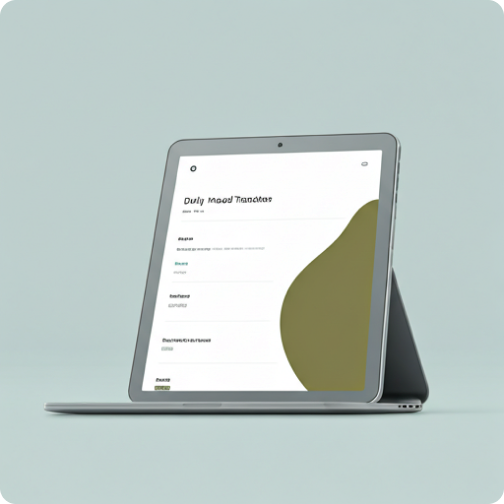
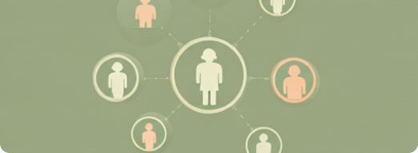

<p align="center">
  
</p>

<h1 align="center">Munity</h1>

<p align="center">
  <strong>Nurtured Stability</strong><br />
  Mental wellness · peer support · licensed therapy
</p>

<p align="center">
  
  
  
  
  
  
</p>

<p align="center">
  <a href="#-demo-credentials">🔑 Credentials</a> ·
  <a href="#-quick-start">🚀 Quick start</a> ·
  <a href="#-product-map">🗺️ Product map</a> ·
  <a href="#-local-urls">🔗 URLs</a>
</p>

---

<p align="center">
  
</p>

**Munity** connects people with peer communities, curated wellness resources, and licensed therapists — with a calm olive/sage clinical UI.

| 👤 Members | 🩺 Therapists | 🛡️ Admins |
|:---:|:---:|:---:|
| Feed, communities, therapy & resources | Onboarding, dashboard, patients & notes | Reviews, platform overview |
| `/login` → `/home` | `/therapistlogin` → `/therapistdashboard` | `/admin/login` → `/admin` |

> ✨ **No backend required.** Without Supabase env vars, the app runs in preview mode with seed data and the demo accounts below.

---

## 🔑 Demo credentials

Use these when Supabase is **not** configured. Login screens also show and pre-fill them.

<br />

### 👤 Member

| | |
|---|---|
| **Name** | Alex Rivera |
| **Email** | `alex.rivera@munity.app` |
| **Password** | `User1234!` |
| **Login** | [`/login`](http://localhost:3000/login) |
| **Opens** | `/home` — feed, communities, full Resources nav |
| **Access** | Member experience only |

```text
Email:    alex.rivera@munity.app
Password: User1234!
```

<br />

### 🩺 Therapist

| | |
|---|---|
| **Name** | Dr. Elena Aris |
| **Email** | `elena.aris@munity.app` |
| **Password** | `Therapist1234!` |
| **Login** | [`/therapistlogin`](http://localhost:3000/therapistlogin) |
| **Opens** | `/therapistdashboard` — schedule, patients, clinical tools |
| **Access** | Therapist clinical app |

```text
Email:    elena.aris@munity.app
Password: Therapist1234!
```

<br />

### 🛡️ Admin

| | |
|---|---|
| **Name** | Munity Admin |
| **Email** | `admin@munity.app` |
| **Password** | `Admin1234!` |
| **Login** | [`/admin/login`](http://localhost:3000/admin/login) |
| **Opens** | `/admin` — applications, members, support overview |
| **Access** | Admin console |

```text
Email:    admin@munity.app
Password: Admin1234!
```

<br />

> ⚠️ Credentials are **role-scoped**. Therapist login rejects member/admin passwords (and the reverse). Defined in `lib/mock-credentials.ts`.

<p align="center">
  
</p>

---

## 🚀 Quick start

### Prerequisites

- ✅ Node.js **20+**
- ✅ npm (lockfile included)

### Install & run

```bash
npm install
npm run dev
```

Open **[http://localhost:3000](http://localhost:3000)** 🌿

| Command | What it does |
|---------|----------------|
| `npm run dev` | 🔥 Dev server (Turbopack) |
| `npm run build` | 📦 Production build |
| `npm start` | ▶️ Serve production build |
| `npm run lint` | 🧹 ESLint |

### Optional Supabase

Create `.env.local`:

```bash
NEXT_PUBLIC_SUPABASE_URL=your-project-url
NEXT_PUBLIC_SUPABASE_ANON_KEY=your-anon-key
NEXT_PUBLIC_SITE_URL=http://localhost:3000
```

| Mode | Behavior |
|------|----------|
| 🧪 **Preview** (no env) | Mock logins + seed data + `localStorage` onboarding |
| ☁️ **Supabase** | Real auth / OAuth; middleware protects member routes |

---

## 🎨 Brand & stack

### Palette

| Token | Hex | Swatch |
|-------|-----|--------|
| `munity-green` | `#3E5219` | 🟢 Deep olive |
| `munity-lime` | `#D6E7A1` | 🟡 Soft lime |
| `munity-bg` | `#FBF9F8` | ⬜ Warm paper |
| `munity-text` | `#1B1C1C` | ⬛ Near black |
| `munity-muted` | `#45483C` | 🩶 Soft olive gray |

Logo asset: [`public/auth/logo-icon.png`](public/auth/logo-icon.png)

### Built with

| Layer | Choice |
|-------|--------|
| ⚛️ UI | Next.js 16 · React 19 · TypeScript |
| 🎨 Style | Tailwind CSS 4 · Framer Motion · Lucide |
| 🔐 Auth | Supabase (optional) · mock session cookie |
| 🧩 Components | Base UI + `components/ui/` |

> 📘 This Next.js version may differ from older tutorials — check `node_modules/next/dist/docs/` and `AGENTS.md`.

---

## 🗺️ Product map

### 👤 Members

| Path | Feature |
|------|---------|
| `/` | 🏠 Marketing landing |
| `/login` · `/signup` | 🔐 Auth (sets mock session in preview) |
| `/home` | 📰 Feed, mood check-in, composer (auth) |
| `/dashboard` | 📊 Member wellness dashboard (auth) |
| `/Communities` · `/Communities/[slug]` | 👥 Browse / join communities |
| `/Therapy` · `/Therapy/[id]` | 💬 Therapist directory + booking |
| `/messages` | 💬 Threads + send (auth) |
| `/profile` · `/settings` · `/saved` | 👤 Account surfaces (auth) |
| `/resources` | 📚 Resource Hub (public; guests see Resources tab only) |
| `/emergency` · `/privacy` · `/terms` · `/help` | 🆘 Crisis + legal stubs |

**Resource categories:** Anxiety · Depression · Stress · Grief · Relationships · Addiction  
→ each has its own featured guide, cards, and trending list (`lib/resource-categories.ts`).

### 🩺 Therapists

```text
Join → Onboarding (4 steps) → Review screen → Clinical app
```

| Step | Path |
|------|------|
| 1️⃣ Basic info | `/therapistonboarding/basic-info` |
| 2️⃣ Credentials | `/therapistonboarding/credentials` |
| 3️⃣ Specialties | `/therapistonboarding/specialties` |
| 4️⃣ Payout | `/therapistonboarding/payout` |
| ✅ Review | `/therapistcredentialauth` |
| 🏥 Dashboard | `/therapistdashboard` |
| 👥 Patients | `/therapistpatients` |
| 📝 Notes | `/therapistclinicalnotes` (+ per-patient notes persist in mock store) |
| 📊 Analytics | `/therapistanalytics` |
| 👤 Profile | `/therapistprofile` |

Onboarding drafts persist in `localStorage` for read-only previews on the review screen.

Ghana-specific catalogs (licenses, regions, MoMo, banks): `lib/ghana-therapist.ts`

### 🛡️ Admins

| Path | Feature |
|------|---------|
| `/admin/login` | Admin sign-in |
| `/admin` | Platform overview |
| `/admin/moderation` | Report queue (warn / remove / suspend / dismiss) |
| `/admin/communities` · `/growth` · `/therapy` · `/resources` · `/settings` | Console sections |

### 🔌 Preview data layer (for backend handoff)

| File | Role |
|------|------|
| `lib/mock-db.ts` | Seed posts, communities, therapists, chats, reports, bookings |
| `lib/mock-store.ts` | Client mutations + `localStorage` persistence (`munity-mock-store-v1`) |
| `lib/mock-credentials.ts` · `lib/mock-session.ts` | Role-scoped demo auth cookie |
| `lib/supabase/middleware.ts` | Gates member / therapist / admin routes in preview |

Replace `mockStore.*` calls with API requests when wiring the real backend — UI shapes already match intended domain models.

<p align="center">
  
</p>

---

## 📁 Project structure

```text
📦 munity
├── 📂 app/                      # App Router pages & server actions
│   ├── (auth)/                  # Member auth actions
│   ├── admin/                   # Admin login + console
│   ├── therapistonboarding/     # 4-step application
│   ├── therapist*/              # Clinical surfaces
│   ├── Communities/ · Therapy/  # Member directories + detail routes
│   ├── home/ · resources/       # Member + public
│   └── login/ · signup/
├── 📂 components/
│   ├── auth/                    # Shell, demo credential hints
│   ├── therapist*/ · resources/ · home/
│   └── ui/                      # Shared primitives
├── 📂 lib/
│   ├── routes.ts                # 🧭 Canonical paths
│   ├── mock-credentials.ts      # 🔑 Demo accounts
│   ├── mock-session.ts          # Cookie session (preview)
│   ├── mock-db.ts · mock-store.ts  # Interactive seed + mutations
│   ├── onboarding-*.ts          # Application progress & drafts
│   ├── resource-categories.ts   # Hub content by topic
│   ├── ghana-therapist.ts       # GH licensing / payout options
│   ├── supabase/                # Client · server · middleware
│   └── data.ts                  # Legacy seed (prefer mock-db)
├── 📂 hooks/
├── 📂 public/                   # 🖼️ Logos, landing, resources
└── 📄 README.md
```

Prefer `routes` from `lib/routes.ts` over hard-coded paths.

---

## 🔐 Auth behavior

| Mode | Flow |
|------|------|
| 🧪 Preview | Email/password → `munity-mock-session` cookie → role home |
| ☁️ Supabase | `signInWithPassword` / Google OAuth · middleware guards `/home`, communities, therapy, profile… |

`/resources` stays **public**. Sign out clears mock cookie + Supabase session.

---

## 🔗 Local URLs

| 🔗 URL | 📌 Purpose |
|--------|------------|
| http://localhost:3000 | Landing |
| http://localhost:3000/login | 👤 Member login |
| http://localhost:3000/therapistlogin | 🩺 Therapist login |
| http://localhost:3000/admin/login | 🛡️ Admin login |
| http://localhost:3000/resources | 📚 Resource Hub |
| http://localhost:3000/therapistdashboard | 🏥 Therapist dashboard |
| http://localhost:3000/dev | 🗂️ All-screen index |

---

## 🤝 Contributing notes

1. Match existing patterns in the feature folder — don’t invent a parallel design system.
2. Keep PRs scoped; skip drive-by refactors.
3. Navigate with `lib/routes.ts`.
4. Server actions for auth/forms; client components for interaction.
5. From Figma: adapt to Munity tokens/components, don’t paste raw export Tailwind.

---

## 📄 License

Private project (`"private": true`). All rights reserved unless otherwise stated by the owners.

---

<p align="center">
  
  <br />
  <sub>Munity · Nurtured Stability</sub>
</p>
